<h1> Projet BE – Évaluation Commerciale</h1>

Ce projet est une application web de gestion commerciale développée dans le cadre du
<strong>Bureau d’Études (BE)</strong>.
Elle permet de gérer des utilisateurs, des ventes, des équipes commerciales (squads),
des statistiques et une messagerie interne avec gestion des rôles.

<h2> Objectifs du projet</h2>

<ul>
  <li>Mettre en œuvre une architecture <strong>client / serveur</strong></li>
  <li>Gérer une authentification sécurisée</li>
  <li>Implémenter des rôles avec droits spécifiques</li>
  <li>Manipuler des données commerciales réelles</li>
  <li>Travailler en collaboration avec GitHub</li>
</ul>

<h2> Authentification</h2>

La page de connexion permet à l’utilisateur de s’authentifier à l’aide de son email
et de son mot de passe.
En fonction de son rôle, il est redirigé automatiquement vers son tableau de bord.

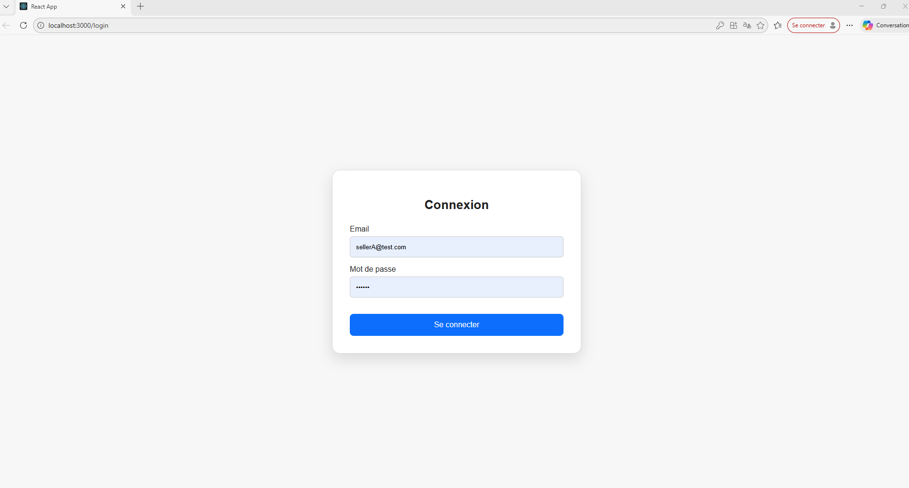

<h2> Dashboard ADMIN</h2>

<h3>Vue générale du tableau de bord administrateur</h3>

Cette vue correspond à l’interface principale de l’administrateur.
Elle donne accès à la gestion des utilisateurs, des squads, au classement global
et à la messagerie interne.

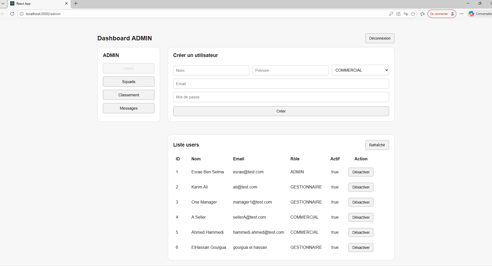

<h3>Création d’un utilisateur</h3>

L’administrateur peut créer un nouvel utilisateur en renseignant son nom,
son prénom, son email, son mot de passe et son rôle
(ADMIN, GESTIONNAIRE ou COMMERCIAL).

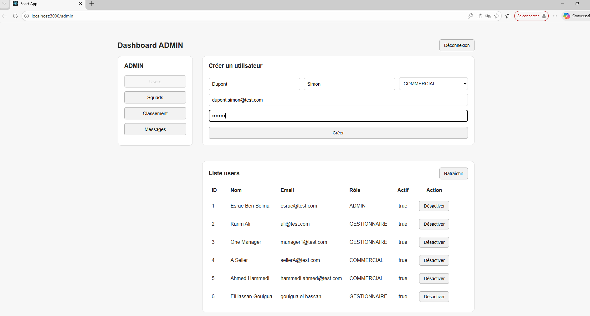

Une confirmation visuelle s’affiche lorsque l’utilisateur est créé avec succès.

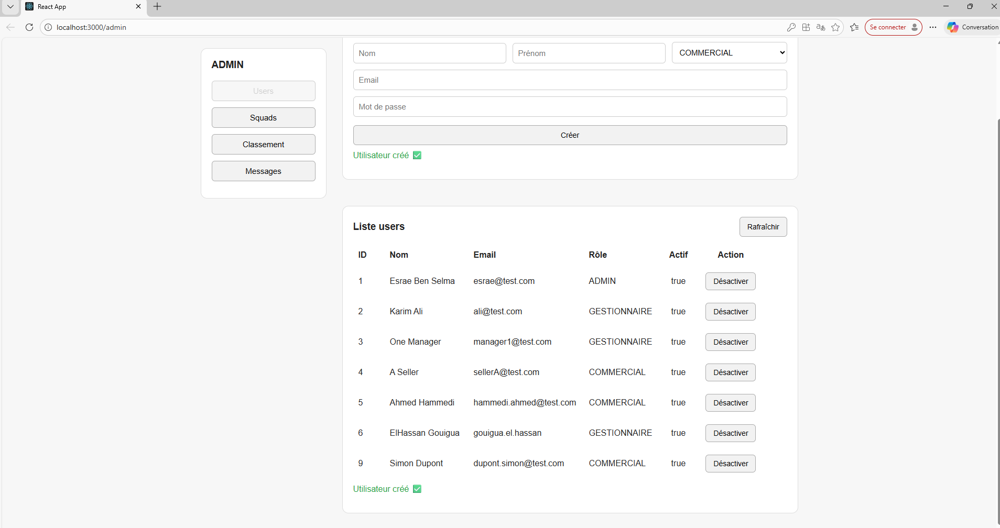

<h3>Gestion des squads</h3>

Cette interface permet à l’administrateur de créer des squads,
d’assigner un gestionnaire à chaque squad
et d’affecter des commerciaux à une équipe.

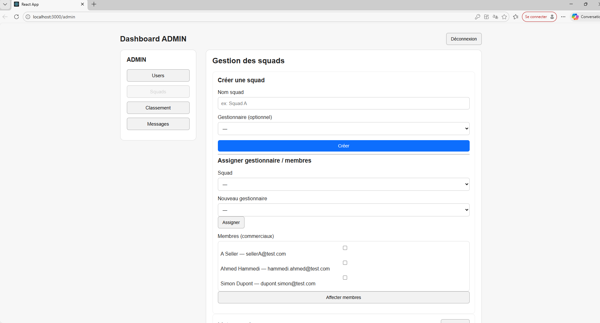

<h3>Classement global des commerciaux</h3>

Le classement global affiche les performances des commerciaux
en fonction du nombre de ventes et du chiffre d’affaires généré.
Il permet de visualiser rapidement les meilleurs vendeurs.

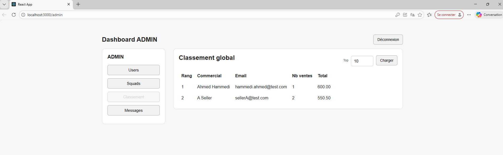

<h3>Messagerie interne – ADMIN</h3>

L’administrateur dispose d’une messagerie interne lui permettant
d’envoyer et de recevoir des messages avec les autres utilisateurs de l’application.

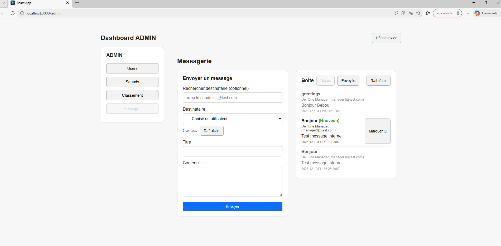

<h2> Dashboard COMMERCIAL</h2>

<h3>Vue générale du tableau de bord commercial</h3>

Le tableau de bord commercial permet au vendeur de gérer ses ventes,
de consulter un résumé de ses performances
et d’accéder à son historique.

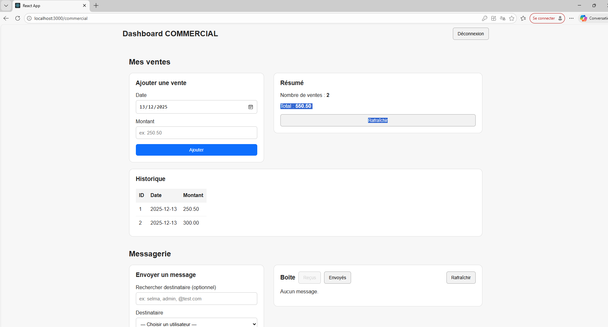

<h3>Ajout d’une vente</h3>

Le commercial peut enregistrer une nouvelle vente
en renseignant la date et le montant.

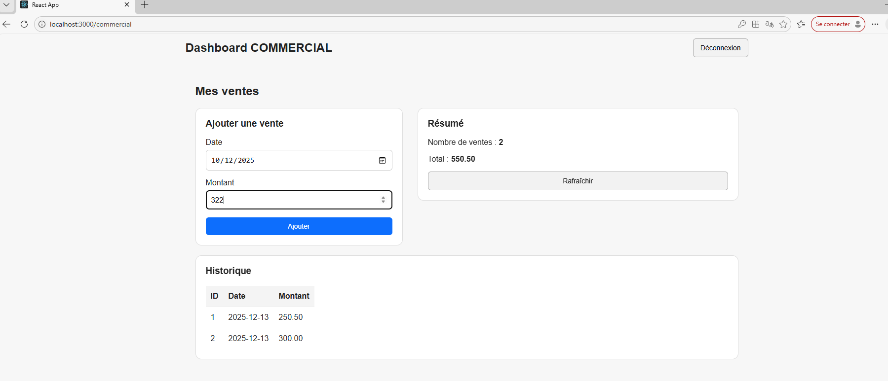

Une confirmation s’affiche lorsque la vente est ajoutée avec succès.

<h3>Messagerie – COMMERCIAL</h3>

Le commercial peut envoyer des messages aux gestionnaires
ou aux administrateurs via la messagerie interne.

Le message envoyé apparaît dans la boîte d’envoi.

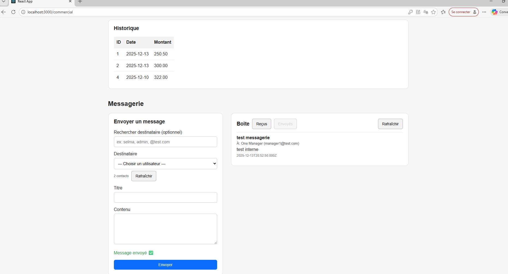

<h2> Dashboard GESTIONNAIRE</h2>

Le gestionnaire dispose d’une vue dédiée lui permettant de suivre
les ventes de sa squad, d’analyser les performances
et de consulter les statistiques par commercial.

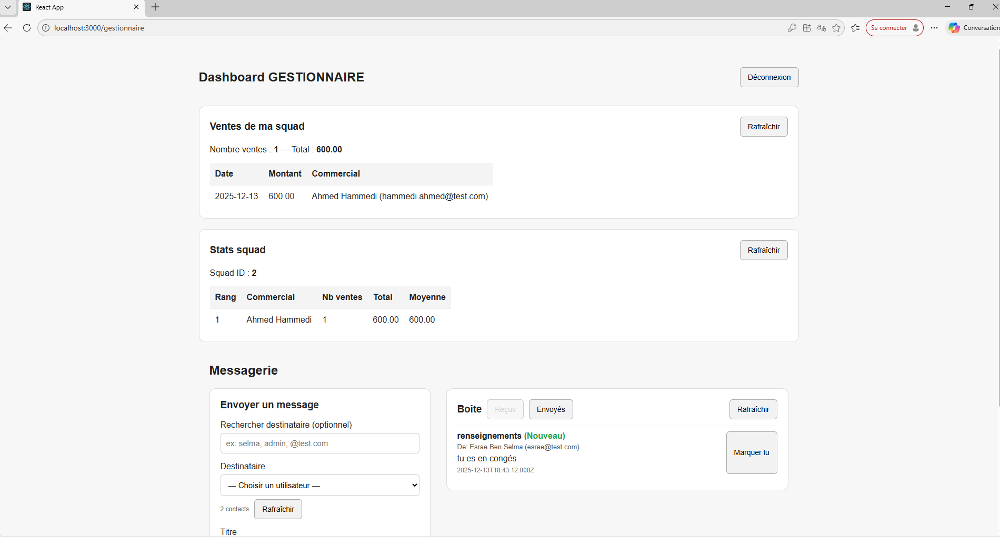

<h2> Technologies utilisées</h2>

<ul>
  <li><strong>Frontend :</strong> React.js</li>
  <li><strong>Backend :</strong> Node.js / Express</li>
  <li><strong>Base de données :</strong> SQL</li>
  <li><strong>Authentification :</strong> JWT</li>
  <li><strong>API :</strong> REST</li>
  <li><strong>Gestion de version :</strong> Git / GitHub</li>
</ul>

<h2> Base de données</h2>

L’application utilise une base de données relationnelle SQL.
Avant de lancer le serveur backend, il est nécessaire de créer
la base de données suivante :

<ul>
  <li><strong>Nom de la base :</strong> <code>eval_commerciale</code></li>
</ul>

Les tables sont ensuite créées automatiquement au démarrage du serveur
grâce à l’ORM utilisé côté backend.

Les paramètres de connexion à la base de données sont définis
via des variables d’environnement.

<h2> Configuration</h2>

Un fichier <code>.env</code> doit être créé à la racine du serveur
avec les variables suivantes :

<pre>
DB_NAME=eval_commerciale
DB_USER=your_db_user
DB_PASS=your_db_password
JWT_SECRET=your_secret_key
</pre>

Ce fichier n’est pas versionné dans GitHub pour des raisons de sécurité.

<h2>▶ Lancer le projet</h2>

<h3>Backend</h3>

<pre>
cd server
npm install
npm run dev
</pre>

<h3>Frontend</h3>

<pre>
cd client
npm install
npm start
</pre>

L’application est accessible par défaut à l’adresse :
<code>http://localhost:3000</code>

<h2> Travail collaboratif</h2>

Le projet a été réalisé en collaboration de :
<ul>
  <li>Ben Selma Esrae</li>
  <li>Gouigua El Hassan</li>
  <li>Hammedi Ahmed</li>
</ul>

<